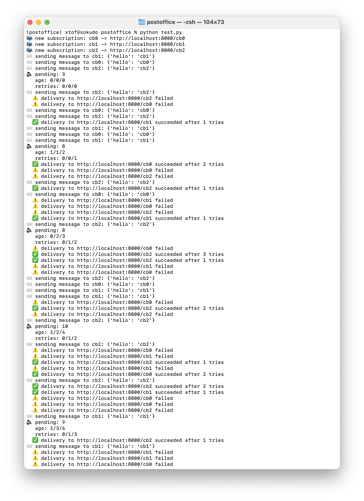

# PostOffice

> simple HTTP POST message delivery with retrying, with mongo persistence

## Rationale

PostOffice is a simple set of Python functions to `subscribe` and `send` JSON messages via a HTTP POST operation. Said messages are persisted in a Mongo collection and are delivered to a subscribing callback endpoint, with an exponential backoff retry mechanism.

Delivery is performed when the `sync` function is invoked. This can be done e.g. from a cron-job or in more "modern" setups from a scheduled lambda or other function.

## Status

When protoyped, I'll turn this into a Python package. Until then the repo can be explored using a provided dummy endpoint server and a test script that generates messages and invokes the syncing.

```console
% pip install -r requirements.txt
% gunicorn -k eventlet -w 1 callback:server
``` 

```console
% python test.py
```


